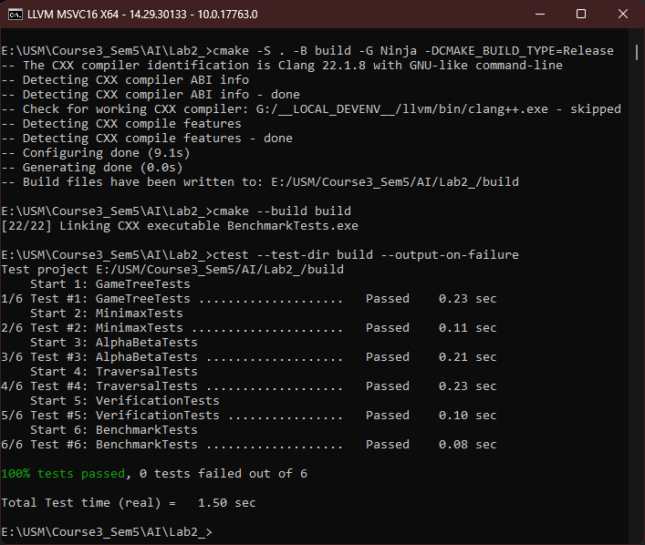
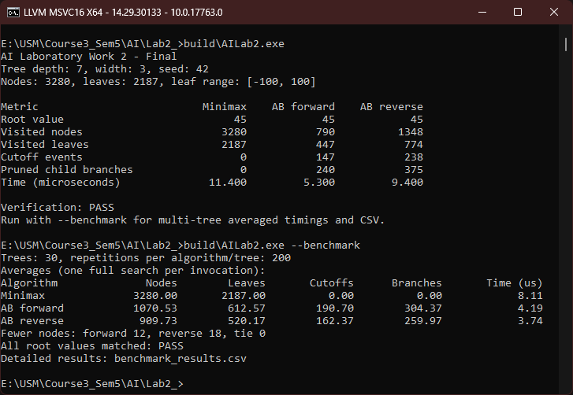

# Лабораторная работа №2 — Мини-макс с альфа-бета отсечением (Вариант 6)

__Студент:__  *Пармакли Леонид IA2404ru*  
__Преподаватель лабораторных работ:__  *Третьякова Елизавета*  
__Преподаватель курса:__  *Григорча Виорел*  

---

## 1. Цель работы

Изучить и реализовать алгоритмы Minimax и Alpha-Beta Pruning на языке C++, исследовать влияние порядка обхода потомков на эффективность отсечений и сравнить количество посещённых узлов и время выполнения алгоритмов.

## 2. Постановка задачи

Согласно варианту №6 необходимо реализовать игровое дерево со следующими параметрами:

| Параметр | Значение |
|---|---|
| Глубина дерева | 7 |
| Ширина дерева | 3 |
| Значения листьев | Случайные целые числа от −100 до 100 |
| Дополнительное условие | Сравнение прямого и обратного обхода потомков |

Под глубиной понимается количество рёбер от корня до листа. Корневой узел принадлежит игроку MAX, далее уровни MAX и MIN чередуются.

Необходимо реализовать обычный Minimax и Minimax с альфа-бета отсечением, проверить корректность полученных результатов и сравнить эффективность алгоритмов.

## 3. Теоретические сведения

### 3.1. Алгоритм Minimax

Minimax — алгоритм поиска оптимального решения в игровом дереве для двух игроков с противоположными интересами.

Игрок MAX выбирает максимальное значение среди потомков, а игрок MIN — минимальное.

Для внутренних узлов:

\[
V(s)=
\begin{cases}
\max V(c), & \text{MAX},\\
\min V(c), & \text{MIN}.
\end{cases}
\]

Для листовых узлов используется заданное значение.

Обычный Minimax просматривает все узлы дерева. Его временная сложность составляет \(O(b^d)\), где \(b\) — ширина, а \(d\) — глубина дерева.

### 3.2. Альфа-бета отсечение

Alpha-Beta Pruning — оптимизация Minimax, позволяющая пропускать поддеревья, которые не могут повлиять на итоговый результат.

Используются две границы:

- `alpha` — лучшая нижняя граница для игрока MAX;
- `beta` — лучшая верхняя граница для игрока MIN.

Если выполняется условие:

\[
\alpha \geq \beta
\]

оставшиеся потомки текущего узла не рассматриваются.

Альфа-бета отсечение сохраняет итоговое минимаксное значение, но может значительно сократить количество посещённых узлов.

Эффективность алгоритма зависит от порядка обхода потомков.

## 4. Реализация программы

Программа реализована на языке C++17. Для сборки используется CMake.

### 4.1. Генерация игрового дерева

Класс `GameTree` создаёт полное дерево глубиной 7 с тремя потомками у каждого внутреннего узла.

Количество листьев:

\[
L=3^7=2187
\]

Общее количество узлов:

\[
N=\frac{3^8-1}{3-1}=3280
\]

Значения листьев генерируются с помощью `std::mt19937` в диапазоне от −100 до 100.

Для контрольного запуска используется `seed = 42`.

### 4.2. Реализация алгоритмов

Алгоритм `RunMinimax()` рекурсивно обходит дерево, вычисляя значения узлов с учётом чередования игроков MAX и MIN.

Алгоритм `RunAlphaBeta()` дополнительно использует границы `alpha` и `beta`. При выполнении условия `alpha >= beta` необработанные потомки текущего узла пропускаются.

Для исследования порядка обхода реализованы два режима:

```text
Forward: 0 -> 1 -> 2
Reverse: 2 -> 1 -> 0
```

В обоих режимах используется одно и то же игровое дерево.

Программа собирает статистику посещённых узлов, проверенных листьев, событий отсечения и пропущенных ветвей.

### 4.3. Структура проекта

```text
ai_lab2_minimax/
├── CMakeLists.txt
├── README.md
├── src/
│   ├── GameTree.h / .cpp
│   ├── Minimax.h / .cpp
│   ├── AlphaBeta.h / .cpp
│   ├── Benchmark.h / .cpp
│   └── main.cpp
└── tests/
    ├── GameTreeTests.cpp
    ├── MinimaxTests.cpp
    ├── AlphaBetaTests.cpp
    ├── TraversalTests.cpp
    ├── VerificationTests.cpp
    └── BenchmarkTests.cpp
```

## 5. Тестирование

Для проверки корректности реализованы шесть наборов автоматизированных тестов.

| Тест | Проверяемая функциональность |
|---|---|
| GameTreeTests | Генерация и структура дерева |
| MinimaxTests | Корректность вычисления Minimax |
| AlphaBetaTests | Корректность отсечений |
| TraversalTests | Прямой и обратный обход |
| VerificationTests | Контрольные и случайные деревья |
| BenchmarkTests | Экспериментальный модуль |

Расширенное тестирование включает 26 636 деревьев с различными значениями листьев, глубиной и шириной.

Все шесть наборов тестов пройдены успешно. Minimax и оба режима Alpha-Beta возвращают одинаковое значение корня на проверенных деревьях.

## 6. Результаты экспериментов

### 6.1. Контрольный запуск

Для дерева глубиной 7, шириной 3 и `seed = 42` получены следующие результаты:

| Показатель | Minimax | AB Forward | AB Reverse |
|---|---:|---:|---:|
| Значение корня | 36 | 36 | 36 |
| Посещено узлов | 3280 | 1186 | 1049 |
| Проверено листьев | 2187 | 695 | 599 |
| Событий отсечения | 0 | 186 | 187 |
| Пропущено ветвей | 0 | 288 | 302 |

Все три алгоритма вернули одинаковое значение корня, однако Alpha-Beta посетил значительно меньше узлов.

### 6.2. Сравнение производительности

Для исследования эффективности проведены эксперименты на 30 деревьях с различными начальными значениями генератора.

На каждом дереве каждый алгоритм выполнялся 200 раз для измерения среднего времени поиска.

Получены следующие средние показатели:

| Показатель | Minimax | AB Forward | AB Reverse |
|---|---:|---:|---:|
| Посещено узлов | 3280,00 | 1008,87 | 984,07 |
| Проверено листьев | 2187,00 | 574,80 | 564,00 |
| Время, мкс | 4,83 | 3,79 | 4,65 |

В проведённой серии экспериментов Alpha-Beta сократил среднее количество посещённых узлов приблизительно на 69–70%.

Прямой обход посетил меньше узлов на 14 деревьях, обратный — на 15. На одном дереве результаты совпали.

Таким образом, эффективность отсечений зависит от порядка обхода потомков. При этом сокращение количества посещённых узлов не всегда приводит к пропорциональному уменьшению времени выполнения.

Приведённые временные показатели относятся к контрольному запуску и могут отличаться на другом компьютере.

## 7. Сборка и запуск

Сборка проекта через CMake и Ninja:

```bat
cmake -S . -B build -G Ninja -DCMAKE_BUILD_TYPE=Release
cmake --build build
```

Запуск программы:

```bat
build\AILab2.exe
```

Запуск экспериментального исследования:

```bat
build\AILab2.exe --benchmark
```

Запуск автоматизированных тестов:

```bat
ctest --test-dir build --output-on-failure
```

После выполнения экспериментального исследования создаётся файл `benchmark_results.csv` с результатами измерений.


### Сборка и тесты


### Вывод программы


## 8. Вывод

В ходе лабораторной работы были реализованы алгоритмы Minimax и Alpha-Beta Pruning на языке C++17.

Проведённое тестирование подтвердило совпадение результатов алгоритмов на проверенных игровых деревьях.

Экспериментальное исследование показало, что альфа-бета отсечение позволяет значительно уменьшить количество посещённых узлов без изменения итогового минимаксного значения.

Установлено, что эффективность отсечений зависит от порядка обхода потомков, а сокращение количества посещённых узлов не всегда сопровождается пропорциональным уменьшением времени выполнения.

Таким образом, цель лабораторной работы достигнута.
